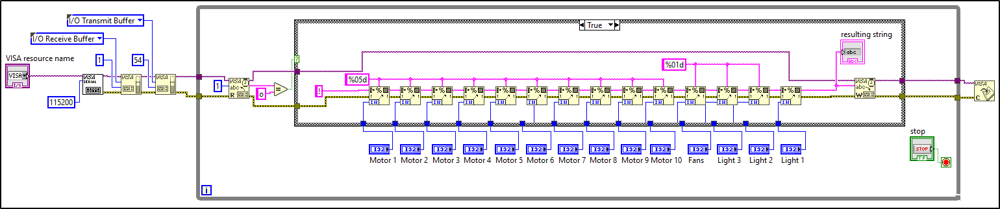
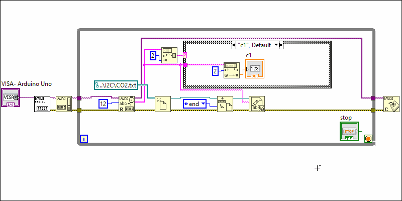

# Documentation

***

Arduino and LabVIEW files designed to allow monitoring and controlling of temperature, CO2 levels, and airflow in a test bed through use of Arduino and DAQ.

***
## A single vi:

### How the vi Works:

This vi contains 4 simultaneously executed while loops, each performing a major function of the apparatus.  These 4 main functions are:

- Control of the plenum fan
- Control of the lights, circulation fans, and valves
- Sensor readings of airflow into each zone
- Sensor readings of the CO2, temperature, and humidity in each zone, inlet, outlet, and main return

The while loops are executed while true. To end the run, switch all 4 loops to false.

***

## The Plenum Fan:

### Hardware:

- 1 DAQ
- 1 Variable speed fan (0-10 V input)

### How the vi Works:

Input a percent power, and the DAQ outputs that percent of 10 V to the variable speed fan.

***

## Motors, Lights, and Circulation Fans:

### Hardware:

- 1 Arduino Mega 2560 R3
- 10 TB6600 Stepper Motor Drivers
- 10 4-Wire NEMA 17 Stepper Motors
- 4 Relays

### How the vi Works:

LabVIEW checks the buffer for a "ready to receive" byte from Arduino.  When received, LabVIEW sends a string containing a confirmation byte, motor positions, and on/off for each relay.

The string sent from LabVIEW breaks down as follows:
- a confirmation "!" character.
- 5 digit integers for each motor #1-10, with left padding of any needed 0's.
- a single 0 or 1 for all circulation fans.
- a 0 or 1 for each relay.

### How the Arduino Code Works:

Arduino communicates to LabVIEW via serial protocol.  It sends a signal if it is ready to receive information, and waits until LabVIEW sends and acknowledged signal, followed by information about lights, circulation fans & stepper position for each motor. Arduino stores that information, closes communication and moves everything to the right place.  It sends an open signal once it is finished, and the process repeats.

***

## Volumetric Air Flow Sensing:

### Hardware:

- 1 DAQ
- 3 airflow sensors

### How the vi Works:

LabVIEW continuously reads 3 voltages from the airflow sensors.  Each voltage is passed through an equation to calculate the CFM.  The average of the most recent 5 CFM readings from each sensor are displayed.

#### The sub-vi:

averages 5 terms

***

## CO2, Temperature, and Humidity Sensing:

### Hardware:

- Arduino Uno
- 8-channel multiplexer
- 6 Grove - CO2 & Temperature & Humidity Sensors for Arduino - SCD30 (https://www.seeedstudio.com/Grove-CO2-Temperature-Humidity-Sensor-SCD30-p-2911.html)

### How the vi Works:

LabVIEW checks the buffer for incoming bytes.  The first 2 bytes received determine the indicator it will be shown in.  It displays each reading in a separate indicator.  The data is timestamped and appended to a plain text file.

### Example:

If the Arduino sends "t521.3" at 5:31 pm, LabVIEW interprets this as the temperature from sensor 5 (t5).  So 21.3 is displayed in the t5 indicator. It appends to the text file "5:31:05 PM - t521.3"

### How the Arduino Code Works:

The Arduino code scans through the 8 channels of the multiplexer and if there is data available to read from the sensor, it will read the data and write to the buffer 2 "identifier" bytes plus the data read.
