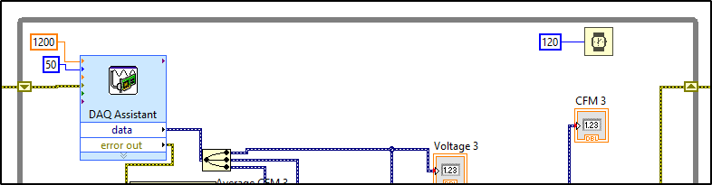

# Troubleshooting

## Motors not moving:

Check that the grounds are connected to the arduino mega.  If one is not, the motor will make a distinct buzzing noise while powered, and will be locked.

## Error -224606 Internal Software Error in MIO

This is a timing error.  Data is still in the buffer when trying to acquire new data.  This error is occurring in the airflow sensor loop.  To solve, set the wait time higher, the rate higher, or the number of samples lower.  This may need to be adjusted sometimes for longer runtimes.

